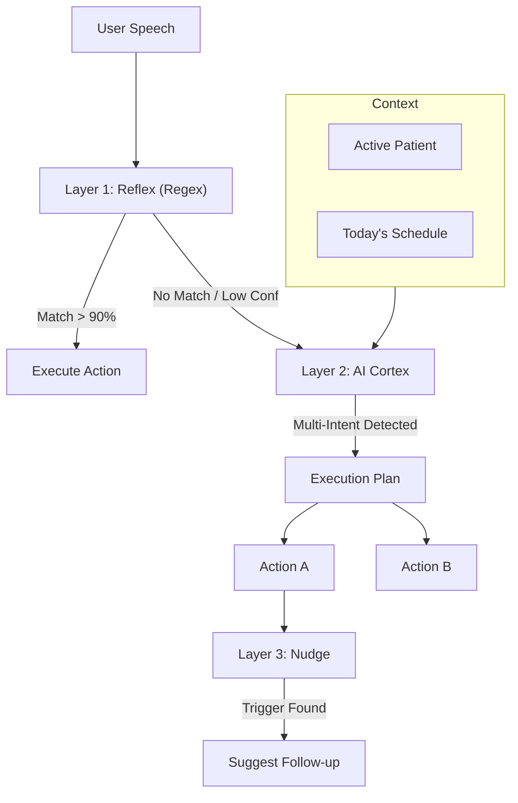

# Architecture Proposal: Swift Intent System V2

**Status:** Draft
**Based on:**
- `ux-evaluation-intent-scalability.md` (The "Don't make me think" rule)
- `ux-simulation-intent-next-level.md` (The "Be my partner" wish)

---

## 1. The Triad Consensus (PO, UX, Dev)

De PO, UX en Lead Developer hebben de bevindingen geanalyseerd. Dit is de gezamenlijke conclusie:

> **"We stoppen met optimaliseren voor milliseconden (Pre-optimization) en starten met optimaliseren voor intelligentie (Agentic UI)."**

*   **PO:** "Akkoord met hogere 'cost per interaction' (AI tokens) als dit directe tijdwinst oplevert voor de zorgverlener (minder administratie)."
*   **UX:** "De interface moet 'Invisible' worden. Geen commando's leren, maar intenties uitspreken."
*   **Dev:** "De huidige 'Strict Hierarchy' (Strategie 1) is te rigide. We gaan voor een **Hybrid Leader/Follower architectuur**: Lokale snelheid waar kan, AI intelligentie waar moet."

---

## 2. Core Architecture: "The Swift Cortex"

We vervangen de simpele `Classifier` door een slimmere `Cortex`.

### Layer 1: The Reflex Arc (Lokaal, <20ms)
*   **Wat:** Regex & Keyword matching (zoals nu).
*   **Doel:** Directe actie voor "High Confidence, Low Risk" commando's.
*   **Scope:** Navigatie, simpele queries ("Agenda vandaag"), start commando's.

### Layer 2: The Intent Orchestrator (AI, ~400ms)
*   **Wat:** Een kleine LLM (Haiku/Gemini Flash) die fungeert als "Router".
*   **Nieuwe capability: Multi-Intent Parsing.**
    *   *Input:* "Zeg Jan af en zet in zijn dossier dat hij griep heeft."
    *   *Output:* `[CancelAppointment(Jan), CreateNote(Jan, "Griep")]`
*   **Nieuwe capability: Entity Disambiguation.**
    *   Snap dat "Jan" verwijst naar de patiënt die ik *vandaaag* in mijn agenda heb.

### Layer 3: The Nudge (Contextual Logic)
*   **Wat:** Een business logic laag die *na* de intent draait.
*   **Functie:** Proactive Suggestions.
    *   *Trigger:* Intent `CreateWoundCareNote` 'completed'.
    *   *Logic:* Check `Protocol(Wondzorg)`.
    *   *Action:* Suggest `ScheduleFollowUp`.

---

## 3. Implementation Roadmap

### Phase 1: Hybrid Foundation (Week 1-2)
*   [ ] Behoud huidige lokale patterns voor snelheid.
*   [ ] Bouw de **AI Fallback Router** in. Als lokaal faalt (<60% confidence), stuur *direct* volledige context naar AI.
*   [ ] **UX Win:** Geen "Ik begrijp het niet" meer. Altijd een poging tot begrip.

### Phase 2: Chains & Context (Week 3-4)
*   [ ] **Context Injectie:** Stuur `ActivePatient`, `RecentIntents`, en `AgendaToday` mee in de AI prompt.
*   [ ] **Multi-Intent Support:** Pas de frontend aan om een *lijst* van acties te verwerken in plaats van één.

### Phase 3: Agentic Proactivity (Maand 2)
*   [ ] **Suggestion Engine:** UI element (Toaster/Card) dat vraagt: *"Wil je ook X doen?"*
*   [ ] **Medical Knowledge Base:** Koppel protocollen aan intents.

---

## 4. Technisch Ontwerp Schets (Dev)

