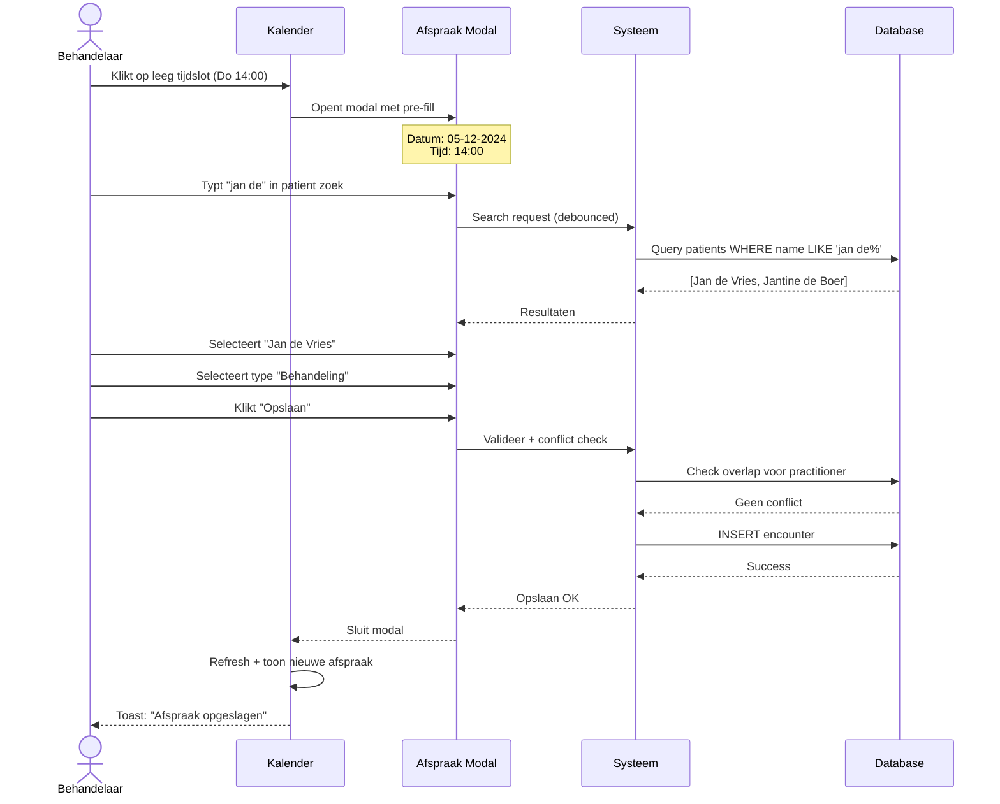

# 🧩 Functioneel Ontwerp (FO) – Agenda Module

**Projectnaam:** Mini-EPD Agenda Module
**Versie:** v1.1
**Datum:** 02-12-2024
**Auteur:** Colin

---

## 1. Doel en relatie met het PRD

🎯 **Doel van dit document:**
Dit Functioneel Ontwerp beschrijft **hoe** de Agenda Module uit het PRD functioneel zal werken — wat de behandelaar ziet, doet en ervaart. Waar het PRD uitlegt *wat en waarom*, laat dit FO zien *hoe dit in de praktijk werkt*.

📘 **Relatie met PRD:**
- PRD-referentie: `prd-agenda-module-v1_0.md`
- Dit FO is de functionele uitwerking van PRD secties 3 (Kernfunctionaliteiten) en 4 (Gebruikersflows)
- Scope is afgebakend op MVP-features; nice-to-have items zijn apart gemarkeerd

**Kernprincipe:**
> De agenda is het kloppend hart van het EPD. Zonder agenda geen dagelijkse workflow, zonder workflow geen AI-integratie in de praktijk.

---

## 2. Overzicht van de belangrijkste onderdelen

🎯 **Doel:** Kort overzicht van schermen en componenten binnen de Agenda Module.

### MVP Onderdelen (Must-Have)

| # | Onderdeel | Beschrijving | Prioriteit |
|---|-----------|--------------|------------|
| 1 | **Kalender View** | Hoofd agenda-weergave met dag/week/werkdagen toggle | 🔴 Kritiek |
| 2 | **Afspraak Modal** | Formulier voor maken/bewerken afspraken | 🔴 Kritiek |
| 3 | **Patient Zoeken** | Autocomplete voor patient selectie | 🔴 Kritiek |
| 4 | **Conflict Dialog** | Waarschuwing bij dubbele boekingen | 🔴 Kritiek |
| 5 | **Afspraak Detail Popup** | Quick-view met acties (verslag maken, bewerken) | 🔴 Kritiek |
| 6 | **Toolbar** | Datum navigatie, view switcher | 🟡 Hoog |

### Stretch/Nice-to-Have Onderdelen

| # | Onderdeel | Beschrijving | Prioriteit |
|---|-----------|--------------|------------|
| 7 | Mini Kalender Sidebar | Maandoverzicht met navigatie | 🟢 Stretch |
| 8 | Recente Patiënten | Quick-select laatste 5 patiënten | 🟢 Stretch |
| 9 | Kleurcodering | Visuele type-indicator (intake/behandeling/follow-up) | 🟢 Stretch |

### Niet in Scope (Post-MVP)

| Onderdeel | Reden exclusie |
|-----------|----------------|
| Multi-practitioner view | Te complex voor MVP, single-user focus |
| Recurring appointments | Beperkte demo-waarde, hoge complexiteit |
| Email/SMS notificaties | Aparte infrastructuur nodig |
| Wachtlijstbeheer | Buiten scope AI Speedrun |
| Video call integratie | Geen core EPD functionaliteit |

---

## 3. User Stories

🎯 **Doel:** Beschrijven wat gebruikers moeten kunnen doen, vanuit hun perspectief.

### MVP User Stories

| ID | Als... | Wil ik... | Zodat... | Prio |
|----|--------|-----------|----------|------|
| **AG-US01** | Behandelaar | Mijn agenda bekijken in dag/week view | Ik weet welke patiënten vandaag/deze week komen | 🔴 |
| **AG-US02** | Behandelaar | Snel een nieuwe afspraak maken door op een tijdslot te klikken | Ik direct kan inplannen tijdens telefoongesprek | 🔴 |
| **AG-US03** | Behandelaar | Een patient zoeken tijdens afspraak maken | De afspraak gekoppeld is aan het juiste dossier | 🔴 |
| **AG-US04** | Behandelaar | Een waarschuwing zien bij dubbele boeking | Ik niet per ongeluk overlap creëer | 🔴 |
| **AG-US05** | Behandelaar | De waarschuwing kunnen overrulen | Ik flexibel kan plannen wanneer nodig | 🔴 |
| **AG-US06** | Behandelaar | Een afspraak verzetten via drag-drop | Wijzigingen snel zijn doorgevoerd | 🟡 |
| **AG-US07** | Behandelaar | Vanuit een afspraak direct een verslag starten | AI-verslaglegging naadloos in mijn workflow past | 🔴 |
| **AG-US08** | Behandelaar | Op een afspraak klikken om details te zien | Ik snel patient info kan checken | 🟡 |
| **AG-US09** | Behandelaar | Een afspraak annuleren | Geannuleerde afspraken geregistreerd blijven | 🟡 |

### Stretch User Stories

| ID | Als... | Wil ik... | Zodat... | Prio |
|----|--------|-----------|----------|------|
| **AG-US10** | Behandelaar | Recente patiënten snel selecteren | Repeat-afspraken extra snel gaan | 🟢 |
| **AG-US11** | Behandelaar | Afspraken zien met kleurcodering per type | Ik visueel onderscheid kan maken | 🟢 |
| **AG-US12** | Behandelaar | Een mini-kalender in de sidebar zien | Ik snel naar andere weken kan navigeren | 🟢 |

---

## 4. Functionele werking per onderdeel

🎯 **Doel:** Per component beschrijven wat de gebruiker kan doen en wat het systeem doet.

---

### 4.1 Kalender View (MVP)

**Locatie:** `/epd/agenda`
**Context:** Level 1 navigatie (behandelaar-breed, niet patient-specifiek)

#### Functioneel gedrag

**Views beschikbaar:**
| View | Beschrijving | Standaard |
|------|--------------|-----------|
| **Dag** | Enkele dag, uren 08:00-18:00 verticaal | Nee |
| **Week** | Ma-Zo, 7 kolommen, uren verticaal | Ja ✓ |
| **Werkdagen** | Ma-Vr, 5 kolommen | Nee |

**Weergave-elementen:**
- **Tijdslots:** 30 minuten interval, visueel onderscheiden met subtle gridlijnen
- **Afspraak blokken:** Patient naam (bold), tijd, type indicator (kleur dot)
- **Huidige tijd indicator:** Rode lijn op "nu" moment + auto-scroll naar nu bij laden
- **Grijze zones:** Tijden buiten werktijden (vóór 08:00, na 18:00) licht gearceerd
- **Vandaag markering:** Huidige dag kolom heeft licht gekleurde achtergrond

**Visuele details kalender grid:**
```
         Ma 2         Di 3         Wo 4 (vandaag)    Do 5
        ─────────────────────────────────────────────────────
 08:00  │            │            │ ░░░░░░░░░░░░░ │            │
        │            │            │ ░░░░░░░░░░░░░ │            │
 09:00  │ ┌────────┐ │            │ ░░░░░░░░░░░░░ │            │
        │ │Jan de V│ │            │ ░─────────────│────────────│  ← Rode "nu" lijn
 10:00  │ │Intake  │ │            │ ░░░░░░░░░░░░░ │ ┌────────┐ │
        │ └────────┘ │            │ ░░░░░░░░░░░░░ │ │Maria J │ │
 11:00  │            │ ┌────────┐ │ ░░░░░░░░░░░░░ │ │Behandel│ │
        │            │ │Piet K. │ │ ░░░░░░░░░░░░░ │ └────────┘ │
```
_Vandaag (wo 4) heeft lichte achtergrondkleur (░)_

**Interacties:**
| Actie | Resultaat | Feedback |
|-------|-----------|----------|
| Klik op leeg tijdslot | Opent Afspraak Modal met datum/tijd pre-filled | Slot krijgt kort highlight |
| Klik op afspraak blok | Opent Afspraak Detail Popup | Blok krijgt ring focus |
| Drag afspraak naar ander slot | Opent Confirm Dialog voor verzetten | Ghost preview op nieuwe locatie |
| Hover op afspraak | Cursor pointer + lichte lift | 100ms delay |
| Hover op leeg slot | Subtle "+" icon verschijnt in slot | Fade-in |
| Double-click leeg slot | Direct modal openen (sneller dan single click) | — |

**States:**
| State | Weergave |
|-------|----------|
| Laden | Skeleton loading met shimmer effect |
| Leeg (week/dag) | Illustratie + "Geen afspraken" + prominent CTA |
| Leeg (eerste gebruik) | Onboarding card met tips |
| Gevuld | Afspraak blokken in grid |
| Fout | Inline error met retry button |
| Offline | Banner: "Je bent offline. Wijzigingen worden gesynchroniseerd." |

**Scroll & Navigatie:**
- Bij pagina laden: auto-scroll naar huidige tijd (met 1 uur marge boven)
- Sticky uur-labels aan linkerkant bij horizontaal scrollen (mobile)
- Sticky dag-headers bij verticaal scrollen

---

### 4.2 Afspraak Modal (MVP)

**Trigger:** Klik op leeg tijdslot OF "Nieuwe afspraak" button OF bewerk-actie

#### Formulier velden

| Veld | Type | Verplicht | Pre-fill | Validatie |
|------|------|-----------|----------|-----------|
| **Patient** | Autocomplete search | ✓ Ja | Nee (of recent als repeat) | Moet bestaande patient zijn |
| **Datum** | Date picker | ✓ Ja | Geklikte datum of vandaag | Warn bij verleden |
| **Starttijd** | Time select (08:00-18:00) | ✓ Ja | Geklikte tijd of volgende vrije | 30 min intervals |
| **Duur** | Select dropdown | ✓ Ja | Automatisch obv type | 15/30/45/60/90/120 min |
| **Type** | Radio buttons | ✓ Ja | Slim obv patient historie | Intake/Behandeling/Follow-up |
| **Notities** | Textarea (collapsed) | Nee | Leeg | Max 500 karakters |

#### Smart Defaults

**Type → Duur koppeling (automatisch bij wijziging type):**
| Type geselecteerd | Duur wordt |
|-------------------|------------|
| Intake | 60 min |
| Behandeling | 45 min |
| Follow-up | 30 min |

_User kan duur nog steeds handmatig wijzigen na auto-fill_

**Type suggestie obv patient historie:**
| Patient situatie | Voorgeselecteerd type |
|------------------|----------------------|
| Nieuwe patient (geen afspraken) | Intake |
| Had intake, geen behandeling | Behandeling |
| Had 3+ behandelingen | Follow-up |
| Laatste afspraak > 6 maanden | Intake (herintake) |

#### Formulier Layout (Progressive Disclosure)

```
┌──────────────────────────────────────────┐
│ Nieuwe afspraak                     ✕    │
├──────────────────────────────────────────┤
│                                          │
│ Patient *                                │
│ ┌──────────────────────────────────────┐ │
│ │ 🔍 Zoek patient...                   │ │  ← Auto-focus hier
│ └──────────────────────────────────────┘ │
│                                          │
│ ┌─────────────────┐  ┌─────────────────┐ │
│ │ 📅 Do 5 dec     │  │ 🕐 14:00    ▼   │ │  ← Compact: datum + tijd
│ └─────────────────┘  └─────────────────┘ │
│                                          │
│ Duur: ○ 30  ● 45  ○ 60  ○ 90 min        │  ← Inline radio (niet dropdown)
│                                          │
│ Type: ○ Intake  ● Behandeling  ○ Follow  │  ← Inline radio
│                                          │
│ [+ Notitie toevoegen]                    │  ← Collapsed by default
│                                          │
├──────────────────────────────────────────┤
│         [Annuleren]    [✓ Opslaan]       │
└──────────────────────────────────────────┘
```

_Bij klik "+ Notitie toevoegen" → expand naar textarea_

#### Inline Validatie

| Veld | Wanneer valideren | Feedback |
|------|-------------------|----------|
| Patient | On blur + na 500ms idle | Rode border + "Selecteer een patient" |
| Datum | On change | Gele border + "Let op: verleden datum" |
| Tijd | On change | Check conflict realtime, toon inline warning |
| Notities | On input | Character counter: "234/500" |

**Conflict preview (inline, vóór submit):**
```
┌──────────────────────────────────────────┐
│ ⚠️ Overlap met: Jan de Vries 14:00      │  ← Inline warning
│    [Andere tijd kiezen] of [Negeren]     │
└──────────────────────────────────────────┘
```

#### Functionaliteit

**Validatie flow (optimized):**
```
1. Bij elk veld change: inline validatie
2. Conflict check: real-time bij datum/tijd wijziging
3. Bij "Opslaan":
   a. Final validation sweep
   b. Als conflict: toon inline warning (niet aparte dialog voor simpele cases)
   c. Als meerdere conflicts: toon Conflict Dialog
   d. Opslaan → optimistic update → toast
```

**Acties:**
| Knop | Gedrag | State |
|------|--------|-------|
| **Opslaan** | Valideer → Sla op → Sluit → Toast | Disabled tijdens save, spinner |
| **Annuleren** | Check unsaved → Sluit modal | — |
| **Verwijderen** (edit) | Inline confirm → Soft delete | Rode tekst, niet prominent |

**Keyboard shortcuts:**
- `Cmd/Ctrl + Enter` = Opslaan (ook vanuit textarea)
- `Escape` = Annuleren (met unsaved check)
- `Tab` = Volgende veld
- `↓` / `↑` in dropdowns = Navigate options

---

### 4.3 Patient Zoeken (MVP)

**Locatie:** Autocomplete input in Afspraak Modal

#### Functioneel gedrag

**Zoeklogica:**
- Minimaal 2 karakters voor zoekstart
- Zoekt op: achternaam, voornaam, BSN (laatste 4 cijfers), geboortedatum
- Resultaten: Max 10, gesorteerd op relevantie (exacte match eerst)
- Debounce: 300ms na laatste toetsaanslag

**Resultaat weergave:**
```
┌──────────────────────────────────────────────┐
│ 🔍 "jan de"                              ⟳   │
├──────────────────────────────────────────────┤
│ ⭐ Recente patiënten                         │  ← Sectie header (subtle)
├──────────────────────────────────────────────┤
│ Jan de Vries                           ↵     │  ← Recent + keyboard hint
│ ♂ 12-03-1985 (39 jaar) · Laatste: 28 nov     │
├──────────────────────────────────────────────┤
│ 🔍 Zoekresultaten                            │  ← Sectie header
├──────────────────────────────────────────────┤
│ Jantine de Boer                              │
│ ♀ 05-08-1972 (52 jaar)                       │
├──────────────────────────────────────────────┤
│ Jan de Groot                                 │
│ ♂ 23-07-1990 (34 jaar)                       │
├──────────────────────────────────────────────┤
│ + Nieuwe patient aanmaken                    │  ← Altijd onderaan
└──────────────────────────────────────────────┘
```

**States:**
| State | Weergave |
|-------|----------|
| Leeg (focus) | Toon recente patiënten (max 5) als suggestie |
| Typen (< 2 chars) | "Typ minimaal 2 karakters..." |
| Zoeken | Spinner rechts in input |
| Resultaten | Recente patiënten bovenaan, dan zoekresultaten |
| Geen resultaat | "Geen patiënt gevonden" + link naar patient aanmaken |
| Geselecteerd | Chip met patient naam + X om te wissen |
| Keyboard navigatie | Highlighted row met subtle achtergrond |

**UX verbeteringen:**
- **Recente patiënten:** Bij focus zonder input, toon laatste 5 bezochte patiënten
- **Match highlighting:** Zoekterm bold in resultaten ("**Jan de** Vries")
- **Keyboard hints:** Toon "↵" icon bij geselecteerde row
- **Laatste afspraak:** Toon "Laatste: 28 nov" voor context
- **Focus management:** Auto-focus op input bij modal open

---

### 4.4 Conflict Dialog (MVP)

**Trigger:** Automatisch bij opslaan afspraak met overlap

#### Functioneel gedrag

**Detectie logica:**
- Check: Nieuwe afspraak `[start, eind]` overlapt met bestaande afspraak(en)?
- Overlap = enige overlap in tijd (inclusief aangrenzend)
- Zelfde behandelaar (huidige user) is criterium

**Dialog inhoud:**
```
┌──────────────────────────────────────────────┐
│ ⚠️  Dubbele boeking gedetecteerd             │
├──────────────────────────────────────────────┤
│                                              │
│ Je hebt al een afspraak op dit tijdstip:     │
│                                              │
│ ┌────────────────────────────────────────┐   │
│ │ 📅 Donderdag 5 dec, 14:00-15:00        │   │
│ │ 👤 Jan de Vries                         │   │
│ │ 📋 Intake                               │   │
│ └────────────────────────────────────────┘   │
│                                              │
│ Wil je de tijd aanpassen of toch inplannen?  │
│                                              │
├──────────────────────────────────────────────┤
│  [Wijzigen]              [Toch inplannen]    │
└──────────────────────────────────────────────┘
```

**Acties:**
| Knop | Gedrag |
|------|--------|
| **Wijzigen** | Sluit dialog, terug naar modal met tijd veld gefocust |
| **Toch inplannen** | Bypass conflict, sla op, sluit alles, toast met waarschuwing |

**Business rule:**
> Systeem waarschuwt maar blokkeert NIET. Behandelaars hebben valide redenen voor overlap (bijv. administratie-tijd, korte telefoon tussendoor).

---

### 4.5 Afspraak Detail Popup (MVP)

**Trigger:** Klik op afspraak blok in kalender

#### Functioneel gedrag

**Popup inhoud:**
```
┌──────────────────────────────────────────────┐
│ Jan de Vries                           ✕     │
│ ♂ 39 jaar · Intake #3                        │
├──────────────────────────────────────────────┤
│ 📅 Do 5 dec 2024                             │
│ 🕐 14:00 - 15:00 (60 min)                    │
│ ● Intakegesprek                              │  ← Kleur dot voor type
├──────────────────────────────────────────────┤
│ Notities:                                    │
│ Eerste gesprek na verwijzing huisarts.       │
│ Verwacht: angstklachten, slaapproblemen.     │
├──────────────────────────────────────────────┤
│                                              │
│  [📝 Maak verslag]              [✏️ Bewerken]│
│                                              │
│  ───────────────────────────────────────     │
│  [👤 Naar dossier]         [🗑️ Annuleren]    │
│                                              │
└──────────────────────────────────────────────┘
```

**Acties:**
| Knop | Gedrag | Visuele prioriteit |
|------|--------|-------------------|
| **📝 Maak verslag** | Navigeer naar rapportage met pre-fills | **Primary** (solid button) |
| **✏️ Bewerken** | Open Afspraak Modal in edit mode | Secondary (outline) |
| **👤 Naar dossier** | Navigeer naar patient dossier | Tertiary (text link) |
| **🗑️ Annuleren** | Confirm dialog → soft delete | Tertiary (text link, rode tekst) |

**Contextuele CTA (slimme primary actie):**
| Afspraak status | Primary actie |
|-----------------|---------------|
| Gepland (toekomst) | "Bewerken" prominent |
| Vandaag/nu | "**Maak verslag**" prominent (pulsing) |
| Verleden zonder verslag | "**Maak verslag**" prominent + badge "!" |
| Verleden met verslag | "Bekijk verslag" + "Bewerken" |

**Status indicatoren:**
| Status | Badge | Extra visueel |
|--------|-------|---------------|
| `planned` | 🔵 Blauw | — |
| Vandaag | 🟢 Groen | Subtle glow effect |
| `in-progress` | 🟢 Groen pulsing | "Nu bezig" label |
| `on-hold` | 🟠 Oranje | Pauze icon |
| `completed` | ⚪ Grijs | Check icon |
| `cancelled` | 🔴 Rood | Doorgestreepte tekst |

**UX verbeteringen:**
- **Quick-action keyboard:** `V` = Verslag maken, `E` = Edit, `D` = Delete
- **Positie:** Popup verschijnt naast afspraak blok, niet centered (context behouden)
- **Click-outside:** Sluit popup
- **Animatie:** Fade-in vanuit afspraak blok positie
- **Verslag indicator:** Als verslag bestaat, toon "📝 Verslag (28 nov)" link in popup

---

### 4.6 Toolbar (MVP)

**Locatie:** Boven kalender grid, sticky bij scrollen

#### Functioneel gedrag

**Desktop layout:**
```
┌──────────────────────────────────────────────────────────────────────────┐
│ [◀] [Vandaag] [▶]   📅 Week 49 · 2-8 december 2024   [Dag|Week|Werk]    │
│                                                      [+ Nieuwe afspraak] │
└──────────────────────────────────────────────────────────────────────────┘
```

**Tablet layout (768-1024px):**
```
┌─────────────────────────────────────────────────────┐
│ [◀] [Vandaag] [▶]    Week 49    [D|W|5]  [+ Nieuw] │
└─────────────────────────────────────────────────────┘
```

**Mobile layout (<768px):**
```
┌─────────────────────────────────┐
│ [◀]  Do 5 december  [▶]  [+]   │  ← Compact, alleen dag
└─────────────────────────────────┘
```

| Element | Gedrag | Keyboard |
|---------|--------|----------|
| **◀ / ▶** | Navigeer 1 periode terug/vooruit | `←` / `→` |
| **Vandaag** | Spring naar huidige datum + scroll naar nu | `T` |
| **Datum label** | Klik → open date picker voor directe navigatie | — |
| **View toggle** | Switch tussen views | `1`/`2`/`3` |
| **+ Nieuwe afspraak** | Open modal zonder pre-fill datum | `N` |

**View toggle states:**
```
┌─────────────────────────────────┐
│ [Dag]  Week   Werkdagen         │  ← Dag geselecteerd
└─────────────────────────────────┘
      ↓ na klik op Week
┌─────────────────────────────────┐
│  Dag  [Week]  Werkdagen         │  ← Week geselecteerd, animated underline
└─────────────────────────────────┘
```

**Extra UX details:**
- **Vandaag button:** Highlight als niet op vandaag (subtle pulsing dot)
- **Datum klik:** Opent kleine kalender picker voor snelle week-jump
- **Navigatie animatie:** Smooth slide transition bij periode wisseling
- **Loading tijdens navigatie:** Spinner in datum label, grid blijft staan

---

### 4.7 Mini Kalender Sidebar (Stretch)

**Locatie:** Linker sidebar op desktop

#### Functioneel gedrag (indien gebouwd)

```
┌────────────────────┐
│   December 2024    │
│ Ma Di Wo Do Vr Za Zo│
│                 1  │
│  2  3  4  5• 6  7  8│
│  9 10 11 12 13 14 15│
│ 16 17 18 19 20 21 22│
│ 23 24 25 26 27 28 29│
│ 30 31               │
└────────────────────┘
```

- **Bullet (•)**: Dagen met afspraken
- **Highlight**: Geselecteerde dag/week
- **Klik op dag**: Navigeer naar die dag in main view

---

## 5. UI-overzicht (visuele structuur)

🎯 **Doel:** Globale schermopbouw communiceren.

### 5.1 Desktop Layout (≥1024px)

```
┌──────────────────────────────────────────────────────────────────────┐
│ EPD Sidebar │              Agenda Module                              │
│             │                                                         │
│ ┌─────────┐ │ ┌─────────────────────────────────────────────────────┐│
│ │Dashboard│ │ │ Toolbar: [◀][Vandaag][▶]  Week 49  [Dag|Week|Werk] ││
│ │─────────│ │ ├─────────────────────────────────────────────────────┤│
│ │Cliënten │ │ │                                                     ││
│ │─────────│ │ │  Ma    Di    Wo    Do    Vr    Za    Zo            ││
│ │►Agenda  │ │ │ ─────────────────────────────────────────          ││
│ │─────────│ │ │ 08:00                                               ││
│ │Rapportage│ │ │ 09:00  ┌────┐                                      ││
│ └─────────┘ │ │ 10:00  │Jan │  ┌────┐                               ││
│             │ │ 11:00  │de V│  │Mari│                               ││
│             │ │ 12:00  └────┘  │    │                               ││
│             │ │ 13:00          └────┘                               ││
│             │ │ 14:00                    ┌────┐                      ││
│             │ │ 15:00                    │Piet│                      ││
│             │ │ 16:00                    └────┘                      ││
│             │ │ 17:00                                               ││
│             │ │ 18:00                                               ││
│             │ └─────────────────────────────────────────────────────┤│
└─────────────┴───────────────────────────────────────────────────────┘
```

### 5.2 Mobile Layout (<768px)

```
┌─────────────────────────┐
│ ≡  Agenda      + Nieuw  │
├─────────────────────────┤
│ ◀  Vandaag  ▶           │
│ Do 5 december 2024      │
├─────────────────────────┤
│ 08:00 ──────────────────│
│ 09:00 ┌───────────────┐ │
│       │ Jan de Vries  │ │
│ 10:00 │ Intake        │ │
│       └───────────────┘ │
│ 11:00 ──────────────────│
│ 12:00 ──────────────────│
│ 13:00 ┌───────────────┐ │
│       │ Maria Jansen  │ │
│ 14:00 │ Behandeling   │ │
│       └───────────────┘ │
│ 15:00 ──────────────────│
│ ...                     │
└─────────────────────────┘
```

**Mobile aanpassingen:**
- Alleen dag-view standaard
- Geen drag-drop (gebruik edit button)
- Swipe links/rechts voor dag navigatie
- Hamburger menu voor EPD sidebar

### 5.3 Afspraak Modal (Responsive)

```
┌──────────────────────────────────────────┐
│ Nieuwe afspraak                     ✕    │
├──────────────────────────────────────────┤
│                                          │
│ Patient *                                │
│ ┌──────────────────────────────────────┐ │
│ │ 🔍 Zoek patient...                   │ │
│ └──────────────────────────────────────┘ │
│                                          │
│ Datum *              Starttijd *         │
│ ┌────────────────┐   ┌────────────────┐  │
│ │ 📅 05-12-2024  │   │ 14:00      ▼   │  │
│ └────────────────┘   └────────────────┘  │
│                                          │
│ Duur *                                   │
│ ┌──────────────────────────────────────┐ │
│ │ 60 minuten                       ▼   │ │
│ └──────────────────────────────────────┘ │
│                                          │
│ Type afspraak *                          │
│ ○ Intake  ● Behandeling  ○ Follow-up     │
│                                          │
│ Notities                                 │
│ ┌──────────────────────────────────────┐ │
│ │                                      │ │
│ │                                      │ │
│ └──────────────────────────────────────┘ │
│                                          │
├──────────────────────────────────────────┤
│         [Annuleren]    [Opslaan]         │
└──────────────────────────────────────────┘
```

---

## 5.5 UX Richtlijnen & Micro-interacties

🎯 **Doel:** Definiëren van de kleine details die de ervaring vloeiend maken.

### 5.5.1 Design Principes

| Principe | Toepassing in Agenda |
|----------|---------------------|
| **Snelheid boven alles** | Afspraak maken < 10 sec, geen onnodige stappen |
| **Visuele feedback** | Elke actie toont direct resultaat |
| **Foutpreventie > foutcorrectie** | Slim valideren vóór submit |
| **Flexibiliteit** | Waarschuwen, niet blokkeren |
| **Context behouden** | Na actie terug naar waar je was |

### 5.5.2 Micro-interacties & Animaties

**Afspraak blokken:**
| Interactie | Visuele feedback | Timing |
|------------|------------------|--------|
| Hover | Lichte schaduw + cursor pointer | Instant |
| Klik | Scale 0.98 + donkerder | 100ms ease |
| Drag start | Opacity 0.7 + verhoogde schaduw | 150ms |
| Drag over slot | Doelslot krijgt highlight border | Instant |
| Drop | Bounce-in animatie naar nieuwe positie | 200ms spring |

**Modals & Dialogs:**
| Actie | Animatie | Timing |
|-------|----------|--------|
| Open | Fade-in + slide-up | 200ms ease-out |
| Sluiten | Fade-out + slide-down | 150ms ease-in |
| Achtergrond | Blur + dim (opacity 0.5) | 200ms |

**Feedback elementen:**
| Element | Gedrag |
|---------|--------|
| Toast success | Slide-in rechtsonder, auto-dismiss 3s |
| Toast warning | Slide-in, persist tot dismiss |
| Loading spinner | Pulse animatie, centered in context |
| Skeleton | Shimmer effect links→rechts |

### 5.5.3 Optimistic Updates

**Principe:** UI update direct, rollback bij fout.

| Actie | Optimistic gedrag | Bij fout |
|-------|-------------------|----------|
| Afspraak opslaan | Direct in kalender tonen | Remove + toast "Opslaan mislukt, probeer opnieuw" |
| Afspraak verzetten | Direct naar nieuwe positie | Terug naar origineel + toast |
| Afspraak annuleren | Direct doorstrepen (visueel) | Herstel + toast |

**Implementatie voorbeeld:**
```
1. User klikt "Opslaan"
2. Modal sluit, afspraak verschijnt in kalender (grijs/loading state)
3. API call in background
4. Success → afspraak krijgt normale styling
5. Error → afspraak verdwijnt, toast met retry optie
```

### 5.5.4 Smart Defaults & Auto-fill

**Tijdslot klikken:**
| Context | Auto-fill |
|---------|-----------|
| Klik op 14:00 | Datum + tijd pre-filled |
| Klik na laatste afspraak | Suggereer aansluitend tijdslot |
| Klik op zelfde dag als recente afspraak | Suggereer zelfde patient |

**Type selectie:**
| Laatste afspraak patient | Suggestie |
|--------------------------|-----------|
| Geen eerdere afspraken | Intake (standaard) |
| Had intake | Behandeling |
| Had 3+ behandelingen | Follow-up |

**Duur selectie:**
| Type | Standaard duur |
|------|----------------|
| Intake | 60 min |
| Behandeling | 45 min |
| Follow-up | 30 min |

### 5.5.5 Keyboard Navigatie

**Globale shortcuts (wanneer op agenda pagina):**
| Shortcut | Actie |
|----------|-------|
| `N` | Nieuwe afspraak (opent modal) |
| `T` | Ga naar vandaag |
| `←` / `→` | Vorige/volgende periode |
| `1` / `2` / `3` | Switch naar Dag/Week/Werkdagen |
| `Esc` | Sluit modal/popup |

**In Afspraak Modal:**
| Shortcut | Actie |
|----------|-------|
| `Tab` | Volgende veld |
| `Shift+Tab` | Vorige veld |
| `Enter` | Opslaan (als geen textarea focus) |
| `Esc` | Annuleren (met unsaved changes check) |
| `↓` / `↑` | Navigeer zoekresultaten |

**In Patient zoeken:**
| Shortcut | Actie |
|----------|-------|
| `↓` | Eerste/volgende resultaat selecteren |
| `↑` | Vorige resultaat |
| `Enter` | Bevestig selectie |
| `Esc` | Sluit dropdown, behoud huidige selectie |

### 5.5.6 Empty States & Onboarding

**Lege agenda (geen afspraken deze week):**
```
┌─────────────────────────────────────────────────┐
│                                                 │
│           📅                                    │
│                                                 │
│     Geen afspraken deze week                    │
│                                                 │
│     Klik op een tijdslot om je eerste          │
│     afspraak in te plannen, of gebruik:         │
│                                                 │
│     [+ Nieuwe afspraak]                         │
│                                                 │
│     💡 Tip: Druk 'N' voor snelle invoer        │
│                                                 │
└─────────────────────────────────────────────────┘
```

**Eerste keer agenda openen (onboarding hint):**
- Subtle pulse animatie op "+ Nieuwe afspraak" button
- Tooltip: "Begin hier met je eerste afspraak"
- Verdwijnt na eerste afspraak of dismiss

### 5.5.7 Error Handling & Recovery

**Graceful degradation:**
| Fout scenario | User ziet |
|---------------|-----------|
| API timeout | "Even geduld..." → na 5s: "Kon niet laden. [Opnieuw proberen]" |
| Conflict check faalt | Sla op zonder conflict check + warning toast |
| Patient search faalt | "Zoeken niet beschikbaar. Typ volledige naam." |

**Undo functionaliteit:**
| Actie | Undo mogelijkheid |
|-------|-------------------|
| Afspraak verwijderd | Toast met "Ongedaan maken" link (5 sec window) |
| Afspraak verzet | Toast met "Ongedaan maken" link (5 sec window) |
| Modal gesloten met unsaved | "Je hebt onopgeslagen wijzigingen. Sluiten?" |

**Unsaved changes detection:**
```
┌──────────────────────────────────────────┐
│ Wijzigingen niet opgeslagen              │
├──────────────────────────────────────────┤
│                                          │
│ Je hebt wijzigingen die nog niet zijn    │
│ opgeslagen. Wil je deze verliezen?       │
│                                          │
├──────────────────────────────────────────┤
│  [Terug naar formulier]   [Niet opslaan] │
└──────────────────────────────────────────┘
```

### 5.5.8 Visual Hierarchy in Kalender

**Tijdslot visuele staten:**
| Staat | Visuele behandeling |
|-------|---------------------|
| Beschikbaar | Wit/licht, hover highlight |
| Bezet | Afspraak blok |
| Verleden | Licht grijs, minder contrast |
| Buiten werktijd | Gestreept/gearceerd patroon |
| Nu (huidige tijd) | Rode lijn indicator |
| Geselecteerd slot | Blue outline |

**Afspraak blok informatie hiërarchie:**
```
┌────────────────────────┐
│ Jan de Vries        📝 │  ← Naam (bold) + verslag icon
│ 14:00 - 15:00          │  ← Tijd (secondary)
│ ● Intake               │  ← Type met kleur dot
└────────────────────────┘
```

**Bij weinig ruimte (korte afspraken 15-30 min):**
```
┌────────────────────────┐
│ J. de Vries  14:00  ●  │  ← Compacte weergave
└────────────────────────┘
```

### 5.5.9 Touch & Mobile Specifiek

**Touch targets:**
- Minimum 44x44px voor alle interactieve elementen
- Afspraak blokken: volledige breedte van kolom

**Gestures:**
| Gesture | Actie |
|---------|-------|
| Swipe links/rechts | Volgende/vorige dag |
| Long press op afspraak | Open context menu (bewerken/verwijderen) |
| Pull down | Refresh agenda data |
| Tap op leeg slot | Toon "+" button → tap = nieuwe afspraak |

**Mobile-specifieke UI:**
- Geen drag-drop (te foutgevoelig op touch)
- Bottom sheet ipv centered modal
- Sticky header met datum bij scrollen

### 5.5.10 Loading States per Component

| Component | Loading state |
|-----------|---------------|
| Agenda grid | Skeleton met 3-4 placeholder blokken |
| Patient search | Spinner in input rechts |
| Modal opslaan | Button disabled + spinner + "Opslaan..." |
| View switch | Fade-out → skeleton → fade-in |
| Datum navigatie | Kort skeleton (200ms max) |

**Perceived performance:**
- Prefetch volgende/vorige week data bij idle
- Cache huidige week, invalidate bij mutatie
- Stale-while-revalidate pattern

---

## 6. Interacties met AI (functionele beschrijving)

🎯 **Doel:** Uitleggen waar AI in de agenda flow voorkomt.

### 6.1 AI-integratiepunten in Agenda Module

| Locatie | AI-actie | Trigger | Output |
|---------|----------|---------|--------|
| Afspraak Detail | **→ Maak verslag** | Klik op "Maak verslag" button | Navigatie naar Rapportage met pre-fills |
| Rapportage (na navigatie) | Transcriptie | Klik "Opname starten" | Audio → tekst via Deepgram |
| Rapportage (na navigatie) | Verslag genereren | Klik "AI genereer" | Gestructureerd verslag op basis van transcriptie |

### 6.2 Afspraak → Verslag Flow (Kernintegratie)

Dit is de **killer feature** van de agenda integratie:

**Stap-voor-stap:**
```
1. Behandelaar klikt op afspraak in agenda (bijv. "Jan de Vries - 10:00 Intake")
2. Detail popup opent met "📝 Maak verslag" button
3. Behandelaar klikt "Maak verslag"
4. Systeem navigeert naar: /epd/patients/[jan-id]/rapportage?encounter=[afspraak-id]
5. Rapportage module opent met:
   - Patient: Jan de Vries (pre-filled, read-only)
   - Type: Intake verslag (pre-selected)
   - Afspraak referentie: 05-12-2024 10:00 (gelinkt)
6. Behandelaar kan direct:
   - Audio opnemen → AI transcribeert
   - AI verslag laten genereren
   - Handmatig schrijven
7. Bij opslaan: verslag automatisch gekoppeld aan afspraak
8. In agenda: afspraak toont nu 📝 icon (verslag aanwezig)
```

**Pre-fill mapping:**

| Rapportage veld | Bron uit Afspraak |
|-----------------|-------------------|
| `patient_id` | `appointment.patient_id` |
| `encounter_id` | `appointment.id` |
| `report_type` | Gebaseerd op `appointment.type` (intake → "intake_verslag") |
| `title` | `"Verslag {type} - {patient_naam} - {datum}"` |

### 6.3 Bidirectionele Linking

**Van Agenda naar Dossier:**
- Afspraak detail popup bevat link naar patient dossier
- Klik "Naar dossier" → `/epd/patients/[id]`

**Van Dossier naar Agenda:**
- In patient timeline: afspraken weergeven
- Klik op afspraak → terug naar agenda met die afspraak geselecteerd

**Van Afspraak naar Verslag:**
- Afspraak icon toont 📝 als verslag bestaat
- Klik op icon → direct naar verslag

**Van Verslag naar Afspraak:**
- Verslag header toont "Gekoppeld aan afspraak: Do 5 dec 14:00"
- Klik → terug naar afspraak detail

---

## 7. Gebruikersrollen en rechten

🎯 **Doel:** Beschrijven welke rollen toegang hebben.

### MVP: Single-User Model

In de MVP is er **geen rechtenbeheer**. Alle functionaliteit is beschikbaar voor de ingelogde behandelaar.

| Rol | Toegang | Beperkingen |
|-----|---------|-------------|
| **Behandelaar** (enige rol) | Volledige agenda | Alleen eigen afspraken zichtbaar |

### Data Scoping

- **Afspraken:** Gefilterd op `practitioner_id = current_user.id`
- **Patiënten:** Alle patiënten in systeem doorzoekbaar (MVP simplificatie)
- **Verslagen:** Alleen eigen verslagen

### Post-MVP: Multi-User Model

| Rol | Toegang | Beperkingen |
|-----|---------|-------------|
| Behandelaar | Eigen agenda | Alleen eigen afspraken bewerken |
| Assistent | Alle agenda's | Inplannen voor anderen, niet verwijderen |
| Manager | Alle agenda's (readonly) | Geen bewerkingen, wel rapportages |

---

## 8. Data Model (Functionele Entiteiten)

🎯 **Doel:** Functioneel overzicht van data-entiteiten.

### 8.1 Afspraak (Encounter)

| Attribuut | Type | Beschrijving |
|-----------|------|--------------|
| `id` | UUID | Unieke identifier |
| `patient_id` | UUID | Gekoppelde patient |
| `practitioner_id` | UUID | Behandelaar (current user) |
| `period_start` | DateTime | Starttijd afspraak |
| `period_end` | DateTime | Eindtijd afspraak |
| `type_code` | Enum | intake / treatment / followup |
| `type_display` | String | "Intakegesprek", "Behandeling", etc. |
| `status` | Enum | planned / in-progress / on-hold / completed / cancelled |
| `notes` | Text | Vrije notities |
| `created_at` | DateTime | Aanmaakdatum |
| `updated_at` | DateTime | Laatste wijziging |

### 8.2 Afspraak Types

| Code | Display (NL) | Standaard duur | Kleur (stretch) |
|------|--------------|----------------|-----------------|
| `intake` | Intakegesprek | 60 min | 🔵 Blauw |
| `treatment` | Behandeling | 45 min | 🟢 Groen |
| `followup` | Follow-up | 30 min | 🟡 Geel |

### 8.3 Status Lifecycle

```
planned → in-progress → completed
    ↓           ↓
on-hold    cancelled (soft delete)
```

| Status | Betekenis | Automatisch |
|--------|-----------|-------------|
| `planned` | Ingepland, nog niet gestart | Bij aanmaken |
| `in-progress` | Momenteel bezig | Bij starttijd? (post-MVP) |
| `on-hold` | Tijdelijk gepauzeerd | Handmatig (post-MVP) |
| `completed` | Afgerond | Handmatig of na verslag opslaan |
| `cancelled` | Geannuleerd | Bij "Verwijderen" actie |

---

## 9. Flows in Detail

🎯 **Doel:** Gedetailleerde stap-voor-stap beschrijvingen.

### 9.1 Flow: Nieuwe Afspraak (Happy Path)

**Scenario:** Behandelaar plant afspraak in tijdens telefoongesprek



### 9.2 Flow: Dubbele Boeking

**Scenario:** Behandelaar probeert afspraak te maken op bezette tijd

```
1. Behandelaar klikt op 14:00 (waar al afspraak staat met Jan de Vries)
2. Modal opent, behandelaar vult Maria Jansen in, klikt Opslaan
3. Systeem detecteert overlap:
   - Nieuwe: Maria 14:00-15:00
   - Bestaand: Jan 14:00-15:00
4. Conflict Dialog opent:
   "⚠️ Je hebt al een afspraak: Jan de Vries - 14:00 (Intake)"
5a. Behandelaar kiest "Wijzigen":
    → Terug naar modal, tijd veld gefocust
    → Kiest 15:00, opslaan succesvol
5b. Behandelaar kiest "Toch inplannen":
    → Beide afspraken op 14:00
    → Toast: "Afspraak opgeslagen (dubbele boeking)"
```

### 9.3 Flow: Afspraak → Verslag

**Scenario:** Direct na intake verslag maken via AI

```
1. Behandelaar klikt op afspraak "Jan de Vries - 10:00 Intake" (zojuist afgelopen)
2. Detail popup opent
3. Behandelaar klikt "📝 Maak verslag"
4. Navigatie naar /epd/patients/[jan-id]/rapportage?encounter=[enc-id]
5. Rapportage module laadt met:
   - Patient: Jan de Vries (locked)
   - Type: Intake verslag
   - Reference: "Afspraak 05-12-2024 10:00"
6. Behandelaar klikt "🎤 Start opname"
7. Behandelaar dicteert verslag van gesprek
8. Behandelaar klikt "Stop"
9. Deepgram transcribeert audio → tekst
10. Behandelaar klikt "AI Genereer verslag"
11. Claude genereert gestructureerd verslag
12. Behandelaar reviewt, past aan, klikt "Opslaan"
13. Verslag opgeslagen met encounter_id link
14. Terug naar agenda: afspraak toont 📝 icon
```

### 9.4 Flow: Drag & Drop Verzetten

**Scenario:** Patient belt, moet naar andere tijd

```
1. Behandelaar ziet afspraak "Maria - Di 14:00" in week view
2. Behandelaar klikt en houdt vast op afspraak card
3. Visuele feedback: card krijgt schaduw, wordt semi-transparant
4. Behandelaar sleept naar "Wo 15:00"
5. Drop → Confirm dialog:
   "Afspraak verzetten van di 14:00 naar wo 15:00?"
   [Annuleren] [Bevestigen]
6. Behandelaar klikt "Bevestigen"
7. Systeem checkt conflict (geen)
8. Database update: period_start = wo 15:00
9. Kalender refresh
10. Toast: "Afspraak verzet naar wo 15:00"
```

---

## 10. Validaties & Business Rules

🎯 **Doel:** Overzicht van validatieregels.

### 10.1 Formulier Validaties

| Veld | Regel | Foutmelding |
|------|-------|-------------|
| Patient | Verplicht, moet bestaan | "Selecteer een patient" |
| Datum | Verplicht, format dd-mm-yyyy | "Vul een datum in" |
| Datum | Niet in verleden | "Datum ligt in het verleden" (warning, niet block) |
| Starttijd | Verplicht, 08:00-18:00 | "Kies een tijd binnen werktijden" |
| Duur | Verplicht, 15-120 min | "Kies een geldige duur" |
| Type | Verplicht | "Kies een type afspraak" |
| Notities | Max 500 karakters | "Notities te lang (max 500)" |

### 10.2 Business Rules

| Regel | Type | Gedrag |
|-------|------|--------|
| **Dubbele boeking** | Warning | Toon dialog, sta override toe |
| **Werktijden** | Soft | Waarschuw bij buiten 08:00-18:00, maar allow |
| **Verleden datum** | Soft | Waarschuw, maar allow (correcties achteraf) |
| **Eigen afspraken** | Hard | Kan alleen eigen afspraken zien/bewerken |
| **Soft delete** | Hard | Cancelled afspraken blijven in DB, niet verwijderd |
| **Verslag koppeling** | Auto | Verslag maakt automatisch link naar encounter |

### 10.3 Conflict Detectie Logica

```
isConflict =
  (new.start < existing.end) AND (new.end > existing.start)
  AND (new.practitioner_id = existing.practitioner_id)
  AND (existing.status != 'cancelled')
```

---

## 11. Prioritering MVP vs Post-MVP

🎯 **Doel:** Duidelijke cut-off voor eerste oplevering.

### MVP (Must Ship)

| Feature | Reden |
|---------|-------|
| Week view kalender | Core navigatie |
| Dag view kalender | Alternatieve weergave |
| Nieuwe afspraak maken | Core functie |
| Patient zoeken (autocomplete) | Koppeling nodig |
| Afspraak bewerken | Wijzigingen nodig |
| Afspraak annuleren (soft delete) | Status management |
| Dubbele boeking warning | Foutpreventie |
| Conflict override | Flexibiliteit |
| "Maak verslag" navigatie | AI-integratie showcase |
| Basic drag-drop (desktop) | Snelle wijzigingen |
| Responsive mobile view | Demo-proof |

### Stretch (Nice-to-Have voor Demo)

| Feature | Reden |
|---------|-------|
| Werkdagen view | Extra convenience |
| Mini kalender sidebar | Navigatie gemak |
| Recente patiënten dropdown | Sneller repeat |
| Kleurcodering per type | Visueel |
| Verslag icon op afspraak | Status indicator |

### Post-MVP (Later)

| Feature | Wanneer |
|---------|---------|
| Recurring appointments | Na klantfeedback |
| Multi-practitioner | Bij team gebruik |
| Email/SMS notifications | Bij productie |
| Calendar sync (Google/Outlook) | Enterprise |
| Wachtlijstbeheer | Productie versie |
| Audit logging | Compliance |

---

## 12. Bijlagen & Referenties

🎯 **Doel:** Links naar gerelateerde documenten.

### Interne Documenten

| Document | Beschrijving | Status |
|----------|--------------|--------|
| PRD Agenda Module v1.0 | Productvisie en scope | ✅ Approved |
| TO Agenda Module (volgt) | Technische implementatie | 📋 Te schrijven |
| UX Stylesheet | Design tokens en componenten | ✅ Beschikbaar |
| Database Types | Supabase schema definities | ✅ Gegenereerd |

### Externe Referenties

| Bron | Gebruik |
|------|---------|
| [FullCalendar Docs](https://fullcalendar.io/docs) | Kalender library |
| [shadcn/ui](https://ui.shadcn.com/docs/components) | UI componenten |
| [date-fns](https://date-fns.org/) | Datum manipulatie |
| [FHIR Encounter](https://www.hl7.org/fhir/encounter.html) | Data model referentie |

### Bestaande Code Patronen

Referentie naar bestaande implementaties in codebase:

| Pattern | Locatie | Hergebruik voor |
|---------|---------|-----------------|
| Patient list + search | `app/epd/patients/` | Patient zoeken component |
| Form validation | `app/epd/patients/[id]/intakes/` | Afspraak formulier |
| Modal dialogs | `components/ui/dialog.tsx` | Afspraak modal |
| Toast notifications | `components/ui/toaster.tsx` | Feedback |
| Server actions | `app/epd/patients/[id]/intakes/actions.ts` | CRUD operaties |
| Type definitions | `lib/types/intake.ts` | Appointment types |

---

## Changelog

| Versie | Datum | Auteur | Wijziging |
|--------|-------|--------|-----------|
| v1.0 | 02-12-2024 | Colin | Initieel FO op basis van PRD v1.0 |
| v1.1 | 02-12-2024 | Colin | UX verbeteringen: micro-interacties, smart defaults, keyboard nav, optimistic updates, inline validatie, responsive toolbar, recente patiënten, contextuele CTAs |

---

**Document Status:** ✅ Klaar voor review
**Volgende stap:** → Technisch Ontwerp (TO) Agenda Module

---

## Appendix: UX Checklist voor Implementatie

Snelle checklist voor developers om UX verbeteringen niet te vergeten:

### Must-Have UX (MVP)
- [ ] Auto-scroll naar "nu" bij pagina laden
- [ ] Vandaag kolom highlight
- [ ] Skeleton loading states
- [ ] Optimistic updates met rollback
- [ ] Inline validatie (niet alleen op submit)
- [ ] Smart defaults: type → duur koppeling
- [ ] Keyboard shortcuts: N, T, ←, →, Esc
- [ ] Focus management: auto-focus patient search in modal
- [ ] Toast feedback bij alle acties
- [ ] Unsaved changes warning
- [ ] Recente patiënten bij lege search
- [ ] Contextuele primary button (verslag maken prominent na afspraak)

### Nice-to-Have UX (Stretch)
- [ ] Double-click op slot voor snelle afspraak
- [ ] Hover "+" icon op lege slots
- [ ] Match highlighting in zoekresultaten
- [ ] Slide animaties bij view/datum wisseling
- [ ] Undo toast na delete/verzetten (5 sec window)
- [ ] Prefetch volgende/vorige week
- [ ] Mobile swipe gestures
- [ ] Onboarding hints bij eerste gebruik
